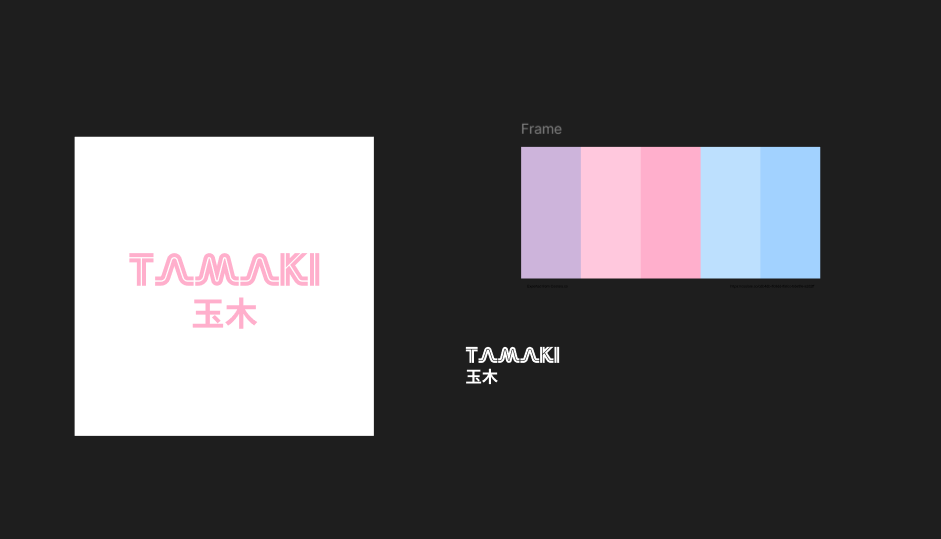
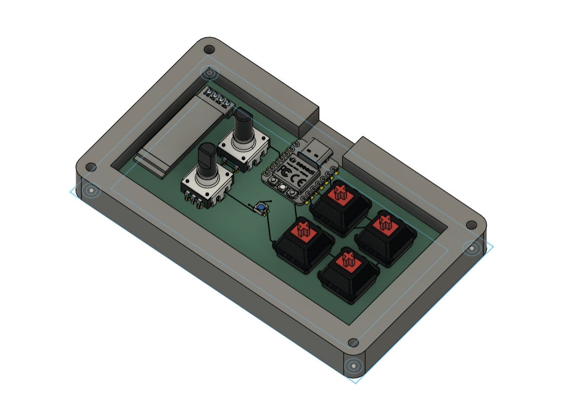
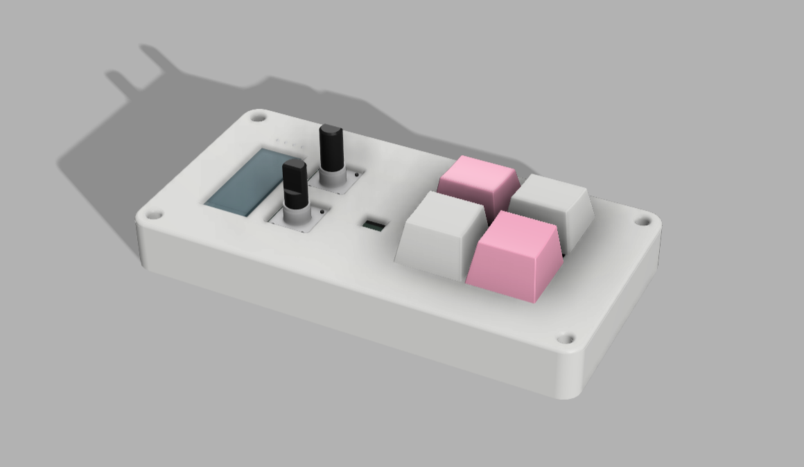

# May 28: Began PCB and Case

Before designing anything I had to come up with what I as even going to build. I got some inspo from a Flipper Zero that I had on my desk and how its like a virtual pet dolphin so I wanted to recrate the same thing with the hackpad. I then thought about a name and decided to name it Tamaki, from Tama (gatchi) ki (Keyboard). After creating the name I went to figma to create a logo and I wanted ot to be kinda retro-y but also have a clean asthetic so I ended up with this.

### Figma

### Logo

## PCB

I read through the guide on how to make a hackpad to get a better understanding and then I started designing the PCB through KiCad. I had some trouble at first importing the footprints and libraries as it has been a while since I've used KiCad. After importing the various footprints I went on thinking about how I wanted the board to be setup and after many iterations I decided on a 4-button an 2-rotary input setup along with an OLED and an LED for status.

Then I created the PCB from the schematic and added all of the traces (it took a bit) and I finished that around 11-12 PM.

## Case

I then opened up Fusion 360 and followed the guide on making the case as I haven't had much experience with Fusion before so I took up the opportunity to learn. After an hour of getting the hang of it I imported the pcb to get a feel for how it was going to look like. After that I went to sleep because it was late (1:30 AM May 29).

# May 29

After working for a few hours I got a the first version of the case. But I don't like the hole for th elight so im thinking about changing it to a normal button.

After a bit of tinkering I decided to make an acrylic window to see the board below.

# May 30

After finishing the case and PCB I wrote the firmware using KMK (still in progress), the 4 buttons I wanted to have configured to various shortcuts and the rotary switches to volume and screen brightness for now. The OLED I will configure when I get the board.
