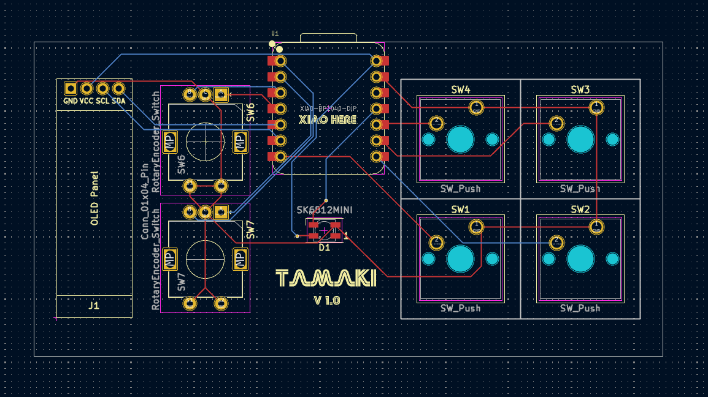

<h1 align="center">
   
  
   
  Tamaki
   
</h1>

<h4 align="center">Project files for a custom Tamagotchi macropad.</h4>

  <a href="#key-features">Key Features</a> •
  <a href="#case-and-cad">Case & CAD</a> •
  <a href="#pcb">PCB</a> •
  <a href="#bom">BOM</a> •
  <a href="#credits">Credits</a> •
  <a href="#license">License</a>

## Key Features

- 4 Configurable Buttons (Cherry MX)
- 2 Rotary Encoders (EC11)
- 1 OLED 128x32 Display
- 1 WS2812B RGB LED
- USB Type-C
- KMK firmware
- OLED-powered Tamagotchi

## Case and CAD

The case includes:

- 3D printed parts: a base and a top cover
- 1 laser-cut acrylic cover to protect electronics
- Assembled with 4x M3 bolts and 4x M3 heatset inserts

Designed in Fusion 360.

## PCB

Designed in KiCad with a custom logo. Notable points:

- `MX_V2` switch footprints
- EC11 encoder footprints
- OLED header and single RGB LED support

 

## BOM

Everything you need to build Tamaki:

- 4x Cherry MX Switches
- 4x Keycaps (DSA or any profile)
- 4x M3x5x4 Heatset Inserts
- 4x M3 Bolts
- 1x WS2812B RGB LED
- 1x 128x32 0.91" OLED Display
- 2x EC11 Rotary Encoders
- 1x XIAO RP2040
- 1x Case (2 printed parts + 1 acrylic cover)

## Credits

This project uses:

- [KiCad](https://www.kicad.org/)
- [Python](https://www.python.org/)
- [Fusion 360](https://www.autodesk.com/products/fusion-360/overview)

## You may also like...

- [Niveles De Niveles](https://github.com/NotARoomba/NivelesDeNiveles) – Real-time flood alert app
- [ROCKETMEN](https://github.com/NotARoomba/ROCKETMEN) – Custom flight controller files

## License

MIT

---

> [notaroomba.dev](https://notaroomba.dev) &nbsp;&middot;&nbsp;
> GitHub [@NotARoomba](https://github.com/NotARoomba)
